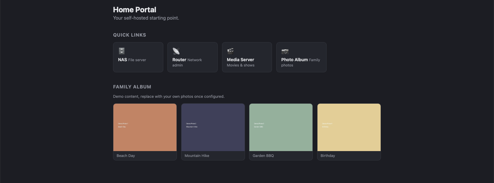

<div align="center">
  

  <h1>Home Portal</h1>
</div>

[](https://github.com/9t29zhmwdh-coder/HomePortal/actions) [](https://github.com/9t29zhmwdh-coder/HomePortal/security/code-scanning) [](https://securityscorecards.dev/viewer/?uri=github.com/9t29zhmwdh-coder/HomePortal) [](https://www.bestpractices.dev/projects/13705)

   

[🇬🇧 English Version](README.md)

Ein schlankes, selbst gehostetes persönliches Webportal auf Basis von FastAPI und Docker. Läuft auf einem NAS oder beliebigem Linux-Server.

> **So läuft es:** Home Portal ist eine selbst gehostete Web-App, kein Desktop-Tool. Sie läuft dauerhaft als Docker-Container (FastAPI hinter Nginx) auf deinem NAS oder Server, und du öffnest sie über einen beliebigen Browser in deinem Netzwerk; es gibt keinen separaten Installer über `docker compose up` hinaus.



<p align="center"><sub>Der Screenshot zeigt Demo-Platzhalterinhalte (Quick Links, Beispiel-"Familienalbum"-Fotos), keine echten Daten.</sub></p>

---

> 🌱 Neu hier? → [Schritt-für-Schritt-Anleitung für Einsteiger](GETTING_STARTED.md)

---

**In der Praxis:** du bringst den Container einmal auf deinem NAS oder Heimserver zum Laufen, und jedes Gerät in deinem Netzwerk bekommt eine einzige Startseite mit Schnellzugriffen auf deine anderen selbst gehosteten Dienste (NAS, Router, Medienserver und Ähnliches) sowie ein kleines Fotoalbum-Widget; weitere Widgets und Bookmark-Bearbeitung stehen auf der [Roadmap](ROADMAP.md).

---

## Tech Stack

| Komponente | Technologie |
|-----------|-----------|
| Backend | [FastAPI](https://fastapi.tiangolo.com) (Python 3.12) |
| Reverse Proxy | [Nginx](https://nginx.org) (Alpine) |
| Laufzeitumgebung | Docker & Docker Compose |
| Speicher | SQLite + lokales Dateisystem |

## Voraussetzungen

- Docker & Docker Compose
- NAS oder Linux-Server

## Installation

```bash
# 1. Repo klonen
git clone https://github.com/9t29zhmwdh-coder/HomePortal.git
cd home-portal

# 2. Konfiguration anpassen
cp .env.example .env
nano .env

# 3. Bauen und starten
docker compose up -d --build
```

Das Portal ist danach unter `http://DEIN-HOST` erreichbar.

## Verzeichnisstruktur

```
home-portal/
├── app/
│   ├── main.py           # FastAPI Einstiegspunkt
│   ├── templates/        # Jinja2-Templates
│   └── static/           # Statische Dateien (CSS, Bilder)
├── nginx/
│   └── default.conf     # Nginx Reverse-Proxy-Konfiguration
├── Dockerfile
├── docker-compose.yml
├── requirements.txt
└── .env.example
```

## Konfiguration

`.env.example` nach `.env` kopieren und anpassen:

| Variable | Beschreibung | Beispiel |
|----------|-------------|---------|
| `DATA_PATH` | Pfad für persistente Daten | `/volume1/docker/home-portal` |
| `TZ` | Zeitzone | `Europe/Zurich` |
| `APP_SECRET_KEY` | Secret Key für Sessions | `zufälliger-string` |

## Nützliche Befehle

```bash
# Logs anzeigen
docker compose logs -f app

# App neustarten
docker compose restart app

# Nach Code-Änderungen neu bauen
docker compose up -d --build

# Stoppen
docker compose down
```

## Deinstallation / Aufräumen

```bash
docker compose down
```

Lösche das in `.env` konfigurierte `DATA_PATH`-Verzeichnis, um alle persistierten Daten zu entfernen, sowie das geklonte Repository-Verzeichnis selbst. Home Portal hinterlässt keine weiteren Spuren auf dem Host.

---

**Autor:** [Rafael Yilmaz](https://github.com/9t29zhmwdh-coder) · **Status:** Active ·  · **Lizenz:** MIT
