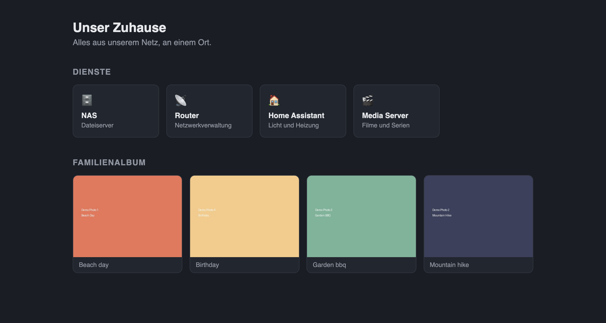

<div align="center">
  

  <h1>Home Portal</h1>
</div>

[](https://github.com/9t29zhmwdh-coder/HomePortal/actions) [](https://github.com/9t29zhmwdh-coder/HomePortal/security/code-scanning) [](https://securityscorecards.dev/viewer/?uri=github.com/9t29zhmwdh-coder/HomePortal) [](https://www.bestpractices.dev/projects/13705)

   

[🇬🇧 English Version](README.md)

**Eine Seite im Heimnetz, die auf alles verlinkt, was du selbst hostest, damit sich niemand die Ports merken muss.**

Das NAS liegt auf `:5000`, Home Assistant auf `:8123`, der Medienserver
irgendwo anders. Du weisst das. Sonst niemand im Haus, und nach zwei Wochen
Ferien du auch nicht mehr.

Home Portal ist eine Startseite mit genau diesen Links darauf, dazu ein kleines
Fotoalbum, als Docker-Container auf dem NAS oder Server, den du ohnehin
betreibst.

**Nichts für dich, wenn** du ein Dashboard mit Live-Status, Sensorwerten oder
Service-Health willst. Da sind Homer, Heimdall und Dashy weiter. Das hier ist
bewusst eine Linkseite, keine Überwachungsoberfläche.

> **So läuft es:** Home Portal ist eine selbst gehostete Web-App, kein Desktop-Tool. Sie läuft dauerhaft als Docker-Container (FastAPI hinter Nginx) auf deinem NAS oder Server, und du öffnest sie über einen beliebigen Browser in deinem Netzwerk; es gibt keinen separaten Installer über `docker compose up` hinaus.



<p align="center"><sub>Screenshot: eine deutsche Variante von <a href="examples/portal.yaml">examples/portal.yaml</a> mit den Platzhalterbildern aus <code>examples/photos/</code>.</sub></p>

---

> 🌱 Neu hier? → [Schritt-für-Schritt-Anleitung für Einsteiger](GETTING_STARTED.md)

---

**In der Praxis:** du bringst den Container einmal auf deinem NAS oder Heimserver zum Laufen, und jedes Gerät in deinem Netzwerk bekommt eine einzige Startseite mit Schnellzugriffen auf deine anderen selbst gehosteten Dienste (NAS, Router, Medienserver und Ähnliches) sowie ein kleines Fotoalbum. Die Links trägst du in eine YAML-Datei ein, die Fotos legst du in einen Ordner; einen Editor im Browser gibt es nicht.

---

## Tech Stack

| Komponente | Technologie |
|-----------|-----------|
| Backend | [FastAPI](https://fastapi.tiangolo.com) (Python 3.12) |
| Reverse Proxy | [Nginx](https://nginx.org) (Alpine) |
| Laufzeitumgebung | Docker & Docker Compose |
| Inhalt | `portal.yaml` und ein Fotoordner, nur lesend eingebunden |

## Voraussetzungen

- Docker & Docker Compose
- NAS oder Linux-Server

## Installation

```bash
# 1. Repo klonen
git clone https://github.com/9t29zhmwdh-coder/HomePortal.git
cd HomePortal

# 2. Konfiguration anpassen
cp .env.example .env
nano .env

# 3. Bauen und starten
docker compose up -d --build
```

Das Portal ist danach unter `http://DEIN-HOST` erreichbar.

## Verzeichnisstruktur

```
HomePortal/
├── app/
│   ├── main.py           # FastAPI-Routen
│   ├── portal.py         # liest portal.yaml und den Fotoordner
│   ├── templates/        # Jinja2-Template
│   └── static/           # Stylesheet
├── examples/             # portal.yaml und Platzhalterfotos als Vorlage
├── nginx/
│   └── default.conf     # Nginx Reverse-Proxy-Konfiguration
├── Dockerfile
├── docker-compose.yml
├── requirements.txt
└── .env.example
```

## Konfiguration

`.env.example` nach `.env` kopieren und anpassen:

| Variable | Beschreibung | Beispiel |
|----------|-------------|---------|
| `DATA_PATH` | Ordner mit `portal.yaml` und `photos/` | `/volume1/docker/home-portal` |
| `TZ` | Zeitzone | `Europe/Zurich` |

## Deine Links und Fotos

Alles auf der Seite kommt aus dem Ordner, auf den `DATA_PATH` zeigt:

```
DATA_PATH/
├── portal.yaml      Titel, Überschriften und Links
└── photos/          .jpg, .png, .webp oder .gif, der Dateiname wird zur Bildunterschrift
```

Als Vorlage dient [`examples/portal.yaml`](examples/portal.yaml):

```yaml
title: Unser Zuhause
subtitle: Alles aus unserem Netz, an einem Ort.
links_heading: Dienste
album_heading: Familienalbum
links:
  - name: NAS
    url: http://192.168.1.10:5000
    description: Dateiserver
    icon: "🗄️"
```

Änderungen erscheinen beim nächsten Neuladen der Seite. Ein Link ohne Namen
oder mit einer URL, die nicht mit `http://` oder `https://` beginnt, wird
übersprungen und oben auf der Seite genannt. Das Album zeigt bis zu 60 Fotos,
nach Dateiname sortiert; versteckte Dateien und alles, was kein Bild ist,
bleiben draussen. Fehlt `portal.yaml`, sagt die Seite, wo die Datei hingehört,
statt erfundene Links zu zeigen.

Der Container bindet den Ordner nur lesend ein. Home Portal verändert deine
Dateien nie.

## Nützliche Befehle

```bash
# Logs anzeigen
docker compose logs -f app

# App neustarten
docker compose restart app

# Nach Code-Änderungen neu bauen
docker compose up -d --build

# Stoppen
docker compose down
```

## Deinstallation / Aufräumen

```bash
docker compose down
```

Danach das geklonte Repository-Verzeichnis löschen. Der `DATA_PATH`-Ordner enthält nur deine eigene `portal.yaml` und deine Fotos, in die Home Portal nie geschrieben hat; behalten oder löschen, wie du willst. Home Portal hinterlässt keine weiteren Spuren auf dem Host.

---

**Autor:** [Rafael Yilmaz](https://github.com/9t29zhmwdh-coder) · **Status:** Aktiv ·  · **Lizenz:** MIT
