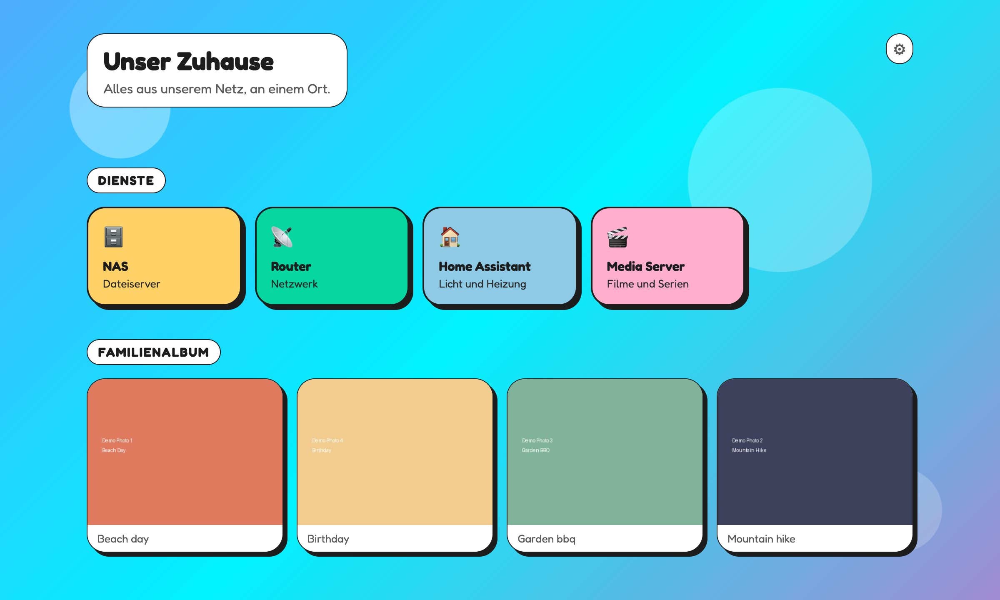
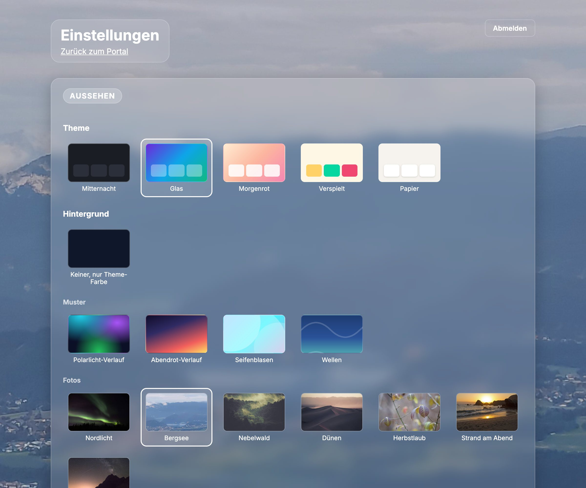
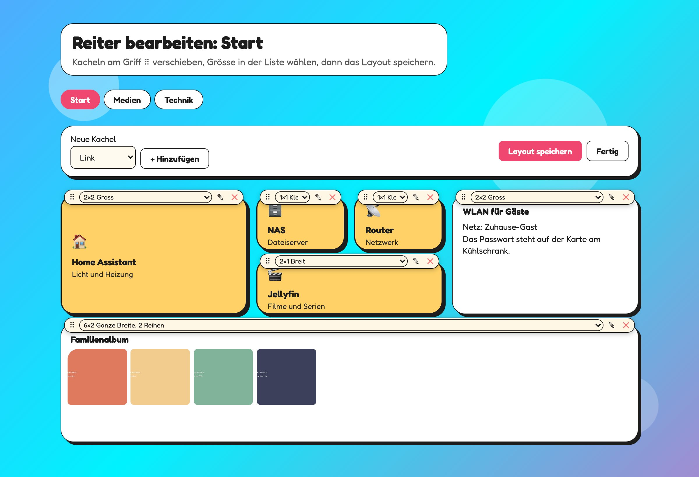

<div align="center">
  

  <h1>Home Portal</h1>
</div>

[](https://github.com/9t29zhmwdh-coder/HomePortal/actions) [](https://github.com/9t29zhmwdh-coder/HomePortal/security/code-scanning) [](https://securityscorecards.dev/viewer/?uri=github.com/9t29zhmwdh-coder/HomePortal) [](https://www.bestpractices.dev/projects/13705)

   

[🇬🇧 English Version](README.md)

**Eine Seite im Heimnetz, die auf alles verlinkt, was du selbst hostest, damit sich niemand die Ports merken muss.**

Das NAS liegt auf `:5000`, Home Assistant auf `:8123`, der Medienserver
irgendwo anders. Du weisst das. Sonst niemand im Haus, und nach zwei Wochen
Ferien du auch nicht mehr.

Home Portal ist eine Startseite mit genau diesen Links darauf, daneben das,
was gerade los ist: Werte aus Home Assistant, welche Dienste antworten, Uhrzeit
und Wetter, dazu ein kleines Fotoalbum. Es läuft als Docker-Container auf dem
NAS oder Server, den du ohnehin betreibst. Eingerichtet wird im Browser: Reiter,
Kacheln in festen Grössen, die du per Ziehen platzierst, ein Theme, ein
Hintergrund, eine Schrift, Deutsch oder Englisch.

**Nichts für dich, wenn** du Verläufe, Diagramme oder Alarme brauchst. Home
Assistant selbst, Grafana oder Uptime Kuma speichern und zeichnen Werte über
die Zeit; Home Portal zeigt den aktuellen Wert und sonst nichts.

> **So läuft es:** Home Portal ist eine selbst gehostete Web-App, kein Desktop-Tool. Sie läuft dauerhaft als Docker-Container (FastAPI hinter Nginx) auf deinem NAS oder Server, und du öffnest sie über einen beliebigen Browser in deinem Netzwerk; es gibt keinen separaten Installer über `docker compose up` hinaus.



<p align="center"><sub>Screenshot: Theme «Verspielt» mit dem Muster «Seifenblasen», Links aus <a href="examples/portal.yaml">examples/portal.yaml</a>, Platzhalterbilder aus <code>examples/photos/</code>.</sub></p>

---

> 🌱 Neu hier? → [Schritt-für-Schritt-Anleitung für Einsteiger](GETTING_STARTED.md)

---

**In der Praxis:** du bringst den Container einmal auf deinem NAS oder Heimserver zum Laufen, und jedes Gerät in deinem Netzwerk bekommt eine einzige Startseite mit Schnellzugriffen auf deine anderen selbst gehosteten Dienste (NAS, Router, Medienserver und Ähnliches) sowie ein kleines Fotoalbum. Beim ersten Start legst du ein Admin-Passwort fest; danach öffnet das Zahnrad die Einstellungen, wo du das Aussehen wählst und Reiter anlegst; der Stift auf einem Reiter lässt dich Kacheln platzieren. Ansehen bleibt in deinem Netz offen, ausser du verlangst auch dafür das Passwort.

---

## Tech Stack

| Komponente | Technologie |
|-----------|-----------|
| Backend | [FastAPI](https://fastapi.tiangolo.com) (Python 3.12) |
| Reverse Proxy | [Nginx](https://nginx.org) (Alpine) |
| Laufzeitumgebung | Docker & Docker Compose |
| Inhalt | `portal.json` im Datenordner, daneben Fotos und Uploads |

## Voraussetzungen

- Docker & Docker Compose
- NAS oder Linux-Server

## Installation

```bash
# 1. Repo klonen
git clone https://github.com/9t29zhmwdh-coder/HomePortal.git
cd HomePortal

# 2. Konfiguration anpassen
cp .env.example .env
nano .env

# 3. Bauen und starten
docker compose up -d --build
```

Das Portal ist danach unter `http://DEIN-HOST` erreichbar.

## Verzeichnisstruktur

```
HomePortal/
├── app/
│   ├── main.py           # Seite, Fotos, Login und Einrichtung
│   ├── settings.py       # Aussehen, Texte, Reiter, Uploads, Zugriff
│   ├── editor.py         # Bearbeiten-Modus: Layout, Kacheln anlegen, ändern, löschen
│   ├── tiles.py          # Kacheltypen, feste Grössen, Layout-Prüfung
│   ├── live.py           # Werte aus Home Assistant, Status und Wetter, zwischengespeichert
│   ├── connections.py    # Adresse und Token von Home Assistant (connections.json)
│   ├── store.py          # portal.json, übernimmt Daten aus 1.2 und 1.3 einmalig
│   ├── auth.py           # Admin-Passwort (Argon2) und Sitzungen
│   ├── uploads.py        # Hintergrund-Uploads, ohne Metadaten neu gespeichert
│   ├── catalog.py        # Themes, Schriften, Muster und Fotos zur Auswahl
│   ├── i18n.py           # Oberflächentexte Englisch und Deutsch
│   ├── templates/        # Jinja2-Templates
│   └── static/           # Stylesheet, Schriften, Hintergrundfotos
├── examples/             # portal.yaml und Platzhalterfotos als Vorlage
├── nginx/
│   └── default.conf     # Nginx Reverse-Proxy-Konfiguration
├── Dockerfile
├── docker-compose.yml
├── requirements.txt
└── .env.example
```

## Konfiguration

`.env.example` nach `.env` kopieren und anpassen:

| Variable | Beschreibung | Beispiel |
|----------|-------------|---------|
| `DATA_PATH` | Ordner für Einstellungen, Uploads und deine `photos/` | `/volume1/docker/home-portal` |
| `TZ` | Zeitzone | `Europe/Zurich` |

## Einrichten

**Erster Start.** Portal öffnen und auf das Zahnrad klicken. Home Portal fragt
nach einem Admin-Passwort (mindestens 10 Zeichen). Wer es zuerst festlegt,
besitzt das Portal, also gleich nach `docker compose up` erledigen.

**Einstellungen.** Hinter dem Zahnrad, nach dem Anmelden:



| Bereich | Was sich ändern lässt |
|---|---|
| Aussehen | Theme (Mitternacht, Glas, Morgenrot, Verspielt, Papier), Hintergrund (keiner, vier gezeichnete Muster, sieben mitgelieferte Fotos oder ein eigenes Bild), Schrift (Inter, Nunito, Fredoka, Playfair Display, JetBrains Mono), Sprache (wie der Browser, Englisch, Deutsch) |
| Texte der Seite | Titel und Untertitel |
| Reiter | Hinzufügen, umbenennen, umsortieren, löschen (mit Rückfrage); jeder Reiter ist eine eigene Seite mit Kacheln |
| Verbindungen | Adresse und langlebiges Zugriffstoken von Home Assistant, mit Verbindungstest |
| Zugriff | Passwort auch zum Ansehen verlangen; Passwort ändern |

**Kacheln.** Auf einem Reiter öffnet der Stift den Bearbeiten-Modus. Kachel
am Griff ⠿ ziehen, Grösse in der Liste wählen, Layout speichern. Kacheln gibt
es in festen Grössen auf einem Raster mit sechs Spalten, so bleibt die Seite
aufgeräumt, egal wo sie landen:

| Kachel | Grössen (Spalten × Reihen) |
|---|---|
| Link | 1×1, 2×1, 1×2, 2×2; Name und Adresse mit `http://` oder `https://` Pflicht, Beschreibung und Emoji freiwillig |
| Notiz | 1×1, 2×1, 1×2, 2×2, 4×1, 6×1; Titel und bis 2000 Zeichen reiner Text |
| Fotoalbum | 2×2, 4×2, 6×2, 6×3; zeigt die Bilder aus dem Ordner `photos` |
| Home Assistant | 1×1, 2×1, 1×2, 2×2, 4×1; ein bis acht Entitäten mit aktuellem Zustand und Einheit, z. B. Temperatur, Lichter, Türen, oder NAS-Sensoren, wenn das NAS in Home Assistant eingebunden ist |
| Status | 1×1, 2×1; grün oder rot und die Antwortzeit für eine beliebige `http(s)`-Adresse |
| Uhr | 1×1, 2×1, 2×2; Zeitzone wählbar |
| Wetter | 1×1, 2×1, 2×2; aktuelles Wetter, Tiefst- und Höchstwert des Tages, Wind, für einen eingetippten Ort |

Live-Kacheln aktualisieren sich alle 30 Sekunden, ohne dass die Seite neu
lädt. Ohne JavaScript zeigen sie die Werte vom Zeitpunkt des Aufrufs.

Auf dem Handy klappt das Raster auf zwei Spalten zusammen und füllt Lücken
selbst.



**Home Assistant.** Unter Einstellungen, Verbindungen die Adresse (zum
Beispiel `http://192.168.1.20:8123`) und ein langlebiges Zugriffstoken
eintragen, das du in Home Assistant unter deinem Profil, Sicherheit,
Langlebige Zugriffstoken erstellst. Der Token liegt in `connections.json`
(Modus 0600), getrennt von den übrigen Einstellungen, und geht nie an den
Browser. Wer die Adresse ändert, muss den Token neu eingeben, damit er nicht
an einen anderen Server umgeleitet werden kann.

**Album.** Die Fotos kommen aus dem Ordner `photos` in `DATA_PATH`
(`.jpg`, `.png`, `.webp`, `.gif`, bis zu 60, nach Dateiname sortiert, der
Dateiname wird zur Bildunterschrift). Hineinkopieren geht mit dem Dateimanager
des NAS; einen Foto-Upload im Browser gibt es nicht.

**Hochgeladene Hintergründe** werden gelesen und als JPEG neu gespeichert,
dabei fallen Standort- und Kameradaten weg. JPEG, PNG, WebP und iPhone-HEIC
bis 20 MB.

**Von 1.2 oder 1.3 umsteigen?** Eine vorhandene `portal.yaml` (1.2) oder
Linkliste (1.3) wird beim ersten Start zum ersten Reiter: jeder Link eine
1×1-Kachel, das Album eine 6×2-Kachel darunter. Danach wird alles im Browser
bearbeitet.

Alles steckt im Container: Schriften, Muster und Fotos kommen von deinem
Server, nicht aus dem Internet. Einzige Ausnahme ist die Wetter-Kachel, die
alle 15 Minuten bei [Open-Meteo](https://open-meteo.com) (kostenlos, ohne
Konto) für den gewählten Ort nachfragt. Bildnachweise und Lizenzen (alle CC0) stehen in
[`app/static/backgrounds/CREDITS.md`](app/static/backgrounds/CREDITS.md), die
Schriftlizenzen (SIL OFL) in
[`app/static/fonts/LICENSE-FONTS.txt`](app/static/fonts/LICENSE-FONTS.txt).
Der Bearbeiten-Modus nutzt [gridstack.js](https://gridstackjs.com) (MIT),
mitgeliefert in `app/static/vendor/gridstack`; die Seite selbst braucht kein
JavaScript.

## Nützliche Befehle

```bash
# Logs anzeigen
docker compose logs -f app

# App neustarten
docker compose restart app

# Nach Code-Änderungen neu bauen
docker compose up -d --build

# Stoppen
docker compose down
```

## Deinstallation / Aufräumen

```bash
docker compose down
```

Danach das geklonte Repository-Verzeichnis löschen. In `DATA_PATH` hat Home Portal `portal.json` (Einstellungen, Reiter und Kacheln), `auth.json` (Passwort-Hash), `connections.json` (Home-Assistant-Token) und `uploads/` angelegt; dein Ordner `photos/` gehört dir und wurde nur gelesen. Lösche, was du nicht mehr brauchst. Home Portal hinterlässt keine weiteren Spuren auf dem Host.

---

**Autor:** [Rafael Yilmaz](https://github.com/9t29zhmwdh-coder) · **Status:** Aktiv ·  · **Lizenz:** MIT
