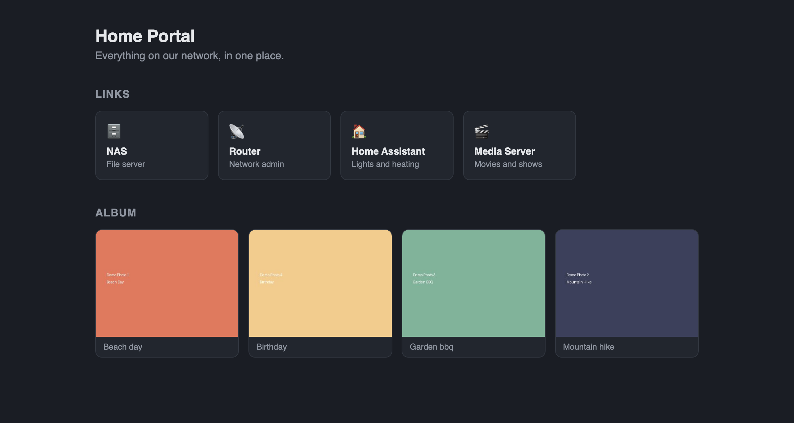

<div align="center">
  

  <h1>Home Portal</h1>
</div>

[🇩🇪 Deutsche Version](README.de.md)

**One page on your network that links to everything you self-host, so nobody has to remember which port it was on.**

Your NAS is on `:5000`, Home Assistant on `:8123`, the media server somewhere
else. You know them. Nobody else in the house does, and neither will you after
a holiday.

Home Portal is one landing page with those links on it, plus a small photo
album, running as a Docker container on the NAS or server you already have.

**Not for you if** you want a dashboard with live status, sensor values or
service health. Homer, Heimdall and Dashy are further along there. This is
deliberately a page of links, not a monitoring surface.

[](https://github.com/9t29zhmwdh-coder/HomePortal/actions) [](https://github.com/9t29zhmwdh-coder/HomePortal/security/code-scanning) [](https://securityscorecards.dev/viewer/?uri=github.com/9t29zhmwdh-coder/HomePortal) [](https://www.bestpractices.dev/projects/13705)

   

> **How it runs:** Home Portal is a self-hosted web app, not a desktop tool. It runs continuously as a Docker container (FastAPI behind Nginx) on your NAS or server, and you open it in any browser on your network; there is no separate installer beyond `docker compose up`.



<p align="center"><sub>Screenshot: <a href="examples/portal.yaml">examples/portal.yaml</a> with the placeholder images from <code>examples/photos/</code>.</sub></p>

---

> 🌱 New here? → [Step-by-step guide for beginners](GETTING_STARTED.md)

---

**In practice:** you deploy the container once on your NAS or home server, and every device on your network gets a single landing page with quick links to your other self-hosted services (NAS, router, media server, and similar) and a small photo album. You edit one YAML file for the links and drop images into a folder for the album; there is no editor in the browser.

---

## Tech Stack

| Component | Technology |
|-----------|-----------|
| Backend | [FastAPI](https://fastapi.tiangolo.com) (Python 3.12) |
| Reverse Proxy | [Nginx](https://nginx.org) (Alpine) |
| Runtime | Docker & Docker Compose |
| Content | `portal.yaml` and a photo folder, mounted read-only |

## Requirements

- Docker & Docker Compose
- NAS or Linux server

## Installation

```bash
# 1. Clone repository
git clone https://github.com/9t29zhmwdh-coder/HomePortal.git
cd HomePortal

# 2. Configure environment
cp .env.example .env
nano .env

# 3. Build and start
docker compose up -d --build
```

The portal will be available at `http://YOUR-HOST`.

## Directory Structure

```
HomePortal/
├── app/
│   ├── main.py           # FastAPI routes
│   ├── portal.py         # reads portal.yaml and the photo folder
│   ├── templates/        # Jinja2 template
│   └── static/           # stylesheet
├── examples/             # portal.yaml and placeholder photos to start from
├── nginx/
│   └── default.conf      # Nginx reverse proxy config
├── Dockerfile
├── docker-compose.yml
├── requirements.txt
└── .env.example
```

## Configuration

Copy `.env.example` to `.env` and adjust:

| Variable | Description | Example |
|----------|-------------|---------|
| `DATA_PATH` | Folder with `portal.yaml` and `photos/` | `/volume1/docker/home-portal` |
| `TZ` | Timezone | `Europe/Zurich` |

## Your links and photos

Everything on the page comes from the folder `DATA_PATH` points to:

```
DATA_PATH/
├── portal.yaml      title, headings and links
└── photos/          .jpg, .png, .webp or .gif, file name becomes the caption
```

Start from [`examples/portal.yaml`](examples/portal.yaml):

```yaml
title: Home Portal
subtitle: Everything on our network, in one place.
links_heading: Links        # write "Dienste" and the page says "Dienste"
album_heading: Album
links:
  - name: NAS
    url: http://192.168.1.10:5000
    description: File server
    icon: "🗄️"
```

Edits show up on the next page reload. A link without a name, or with a URL
that is not `http://` or `https://`, is skipped and named in a notice at the
top of the page. The album shows up to 60 photos, sorted by file name; hidden
files and anything that is not an image are left out. With no `portal.yaml`
the page tells you where to create it instead of showing made-up links.

The container mounts the folder read-only. Home Portal never changes your
files.

## Useful Commands

```bash
# View logs
docker compose logs -f app

# Restart app
docker compose restart app

# Rebuild after code changes
docker compose up -d --build

# Stop
docker compose down
```

---

## Uninstall / Cleanup

```bash
docker compose down
```

Then delete the cloned repository directory. The `DATA_PATH` folder holds only your own `portal.yaml` and photos, which Home Portal never wrote to; keep or delete it as you like. Home Portal has no other host-level state.

---

**Author:** [Rafael Yilmaz](https://github.com/9t29zhmwdh-coder) · **Status:** Active ·  · **License:** MIT
