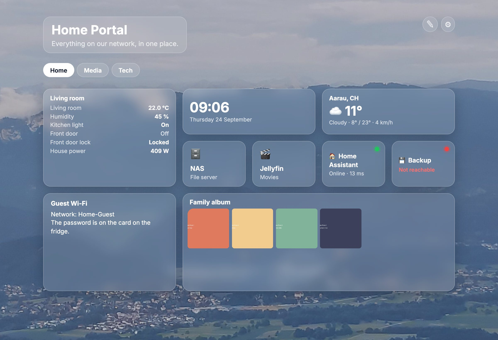
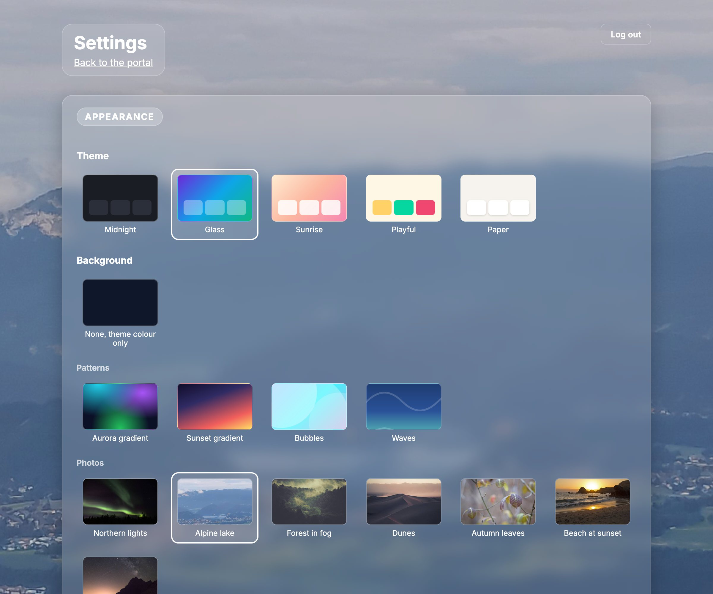
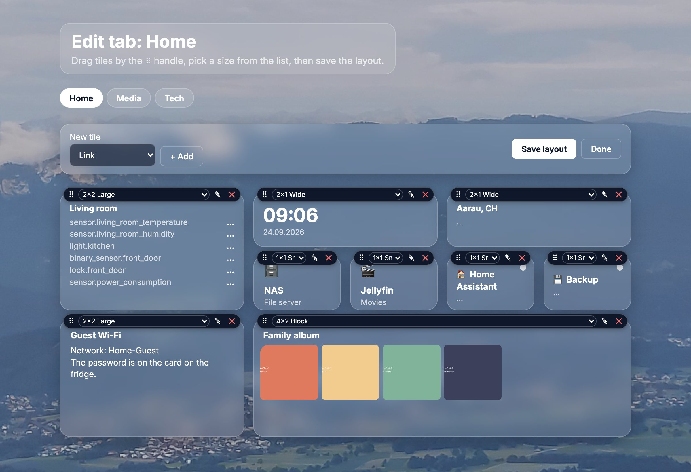

<div align="center">
  

  <h1>Home Portal</h1>
</div>

[🇩🇪 Deutsche Version](README.de.md)

**One page on your network that links to everything you self-host, so nobody has to remember which port it was on.**

Your NAS is on `:5000`, Home Assistant on `:8123`, the media server somewhere
else. You know them. Nobody else in the house does, and neither will you after
a holiday.

Home Portal is one landing page with those links on it, next to what is
happening right now: values from Home Assistant, which services answer, the
time and the weather, and a small photo album. It runs as a Docker container on
the NAS or server you already have. You set it up in the browser: tabs, tiles
you drag into place in fixed sizes, a theme, a background, a font, English or
German.

**Not for you if** you need history, graphs or alerts. Home Assistant itself,
Grafana or Uptime Kuma keep and chart values over time; Home Portal shows the
current value and nothing else.

[](https://github.com/9t29zhmwdh-coder/HomePortal/actions) [](https://github.com/9t29zhmwdh-coder/HomePortal/security/code-scanning) [](https://securityscorecards.dev/viewer/?uri=github.com/9t29zhmwdh-coder/HomePortal) [](https://www.bestpractices.dev/projects/13705)

   

> **How it runs:** Home Portal is a self-hosted web app, not a desktop tool. It runs continuously as a Docker container (FastAPI behind Nginx) on your NAS or server, and you open it in any browser on your network; there is no separate installer beyond `docker compose up`.



<p align="center"><sub>Screenshot: theme "Glass" with the bundled "Alpine lake" photo, links from <a href="examples/portal.yaml">examples/portal.yaml</a>, placeholder images from <code>examples/photos/</code>.</sub></p>

---

> 🌱 New here? → [Step-by-step guide for beginners](GETTING_STARTED.md)

---

**In practice:** you deploy the container once on your NAS or home server, and every device on your network gets a single landing page with quick links to your other self-hosted services (NAS, router, media server, and similar) and a small photo album. On first start you set an admin password; after that the gear icon opens the settings, where you pick how the page looks and add tabs; the pencil icon on a tab lets you place tiles. Viewing stays open on your network unless you require the password for that too.

---

## Tech Stack

| Component | Technology |
|-----------|-----------|
| Backend | [FastAPI](https://fastapi.tiangolo.com) (Python 3.12) |
| Reverse Proxy | [Nginx](https://nginx.org) (Alpine) |
| Runtime | Docker & Docker Compose |
| Content | `portal.json` in the data folder, photos and uploads next to it |

## Requirements

- Docker & Docker Compose
- NAS or Linux server

## Installation

```bash
# 1. Clone repository
git clone https://github.com/9t29zhmwdh-coder/HomePortal.git
cd HomePortal

# 2. Configure environment
cp .env.example .env
nano .env

# 3. Build and start
docker compose up -d --build
```

The portal will be available at `http://YOUR-HOST`.

## Directory Structure

```
HomePortal/
├── app/
│   ├── main.py           # page, photos, login and setup routes
│   ├── settings.py       # appearance, texts, tabs, uploads, access
│   ├── editor.py         # edit mode: tile layout, add, change, remove tiles
│   ├── tiles.py          # tile types, fixed sizes, layout checks
│   ├── live.py           # Home Assistant, status and weather values, cached
│   ├── connections.py    # Home Assistant address and token (connections.json)
│   ├── store.py          # portal.json, migrates 1.2 and 1.3 data once
│   ├── auth.py           # admin password (Argon2) and sessions
│   ├── uploads.py        # background uploads, re-encoded without metadata
│   ├── catalog.py        # themes, fonts, patterns and photos to choose from
│   ├── i18n.py           # English and German interface text
│   ├── templates/        # Jinja2 templates
│   └── static/           # stylesheet, fonts, background photos
├── examples/             # portal.yaml and placeholder photos to start from
├── nginx/
│   └── default.conf      # Nginx reverse proxy config
├── Dockerfile
├── docker-compose.yml
├── requirements.txt
└── .env.example
```

## Configuration

Copy `.env.example` to `.env` and adjust:

| Variable | Description | Example |
|----------|-------------|---------|
| `DATA_PATH` | Folder for settings, uploads and your `photos/` | `/volume1/docker/home-portal` |
| `TZ` | Timezone | `Europe/Zurich` |

## Setting it up

**First start.** Open the portal and click the gear icon. Home Portal asks for
an admin password (at least 10 characters). Whoever sets it first owns the
portal, so do this right after `docker compose up`.

**Settings.** Behind the gear icon, after logging in:



| Section | What you can change |
|---|---|
| Appearance | Theme (Midnight, Glass, Sunrise, Playful, Paper), background (none, four drawn patterns, seven bundled photos, or your own upload), font (Inter, Nunito, Fredoka, Playfair Display, JetBrains Mono), language (browser, English, German) |
| Page texts | Title and subtitle |
| Tabs | Add, rename, reorder, delete (with confirmation); each tab is its own page of tiles, or, with an app address, one app across the whole page |
| Connections | Home Assistant address and long-lived access token, with a connection test |
| Access | Require the password to view the page too; change the password |

**Tiles.** On a tab, the pencil icon opens the edit mode. Drag a tile by its
⠿ handle, pick its size from the list, and save the layout. Tiles come in fixed
sizes on a six-column grid, so the page stays tidy wherever they end up:

| Tile | Sizes (columns × rows) |
|---|---|
| Link | 1×1, 2×1, 1×2, 2×2; name and an `http://` or `https://` address required, description and emoji optional |
| Note | 1×1, 2×1, 1×2, 2×2, 4×1, 6×1; title and up to 2000 characters of plain text |
| Photo album | 2×2, 4×2, 6×2, 6×3; shows the pictures from the `photos` folder |
| Home Assistant | 1×1, 2×1, 1×2, 2×2, 4×1; one to eight entities with their current state and unit, e.g. temperature, lights, doors, or NAS sensors if the NAS is in Home Assistant |
| Status | 1×1, 2×1; green or red and the response time for any `http(s)` address |
| Clock | 1×1, 2×1, 2×2; optional time zone |
| Weather | 1×1, 2×1, 2×2; current weather, today's low and high, wind, for a place you type in |
| App | 2×2 up to 6×4; another web app shown inside the tile |

Live tiles refresh every 30 seconds without reloading the page. Without
JavaScript they show the values from when the page was loaded.

On a phone the grid folds into two columns and fills gaps on its own.



**Home Assistant.** Under Settings, Connections, enter the address (for
example `http://192.168.1.20:8123`) and a long-lived access token, created in
Home Assistant under your profile, Security, Long-lived access tokens. The
token is kept in `connections.json` (mode 0600), apart from the other settings,
and never sent to the browser. Changing the address asks for the token again,
so it cannot be pointed at another server.

**Apps.** An app tile or app tab shows another web app inside Home Portal.
Many apps forbid that with an `X-Frame-Options` or `Content-Security-Policy:
frame-ancestors` header, and a browser then shows an empty box. Home Portal
reads those headers first and, when the app refuses, says so and offers a
button to open it in a new tab instead. Home Assistant sends
`X-Frame-Options: SAMEORIGIN` by default; to embed it, add this to its
`configuration.yaml` and restart it:

```yaml
http:
  use_x_frame_options: false
```

A portal served over `https://` can only embed apps on `https://`; browsers
block `http://` content inside a secure page.

**Album.** Photos come from the `photos` folder in `DATA_PATH`
(`.jpg`, `.png`, `.webp`, `.gif`, up to 60, sorted by name, file name becomes
the caption). Copy them there with the NAS file manager; there is no photo
upload in the browser.

**Uploaded backgrounds** are decoded and saved again as JPEG, which removes
location and camera data. JPEG, PNG, WebP and iPhone HEIC up to 20 MB.

**Coming from 1.2 or 1.3?** An existing `portal.yaml` (1.2) or link list (1.3)
becomes the first tab on first start: each link a 1×1 tile, the album a 6×2
tile below them. After that, everything is edited in the browser.

Everything is bundled in the container: fonts, patterns and photos load from
your server, not from the internet. The one exception is the weather tile,
which asks [Open-Meteo](https://open-meteo.com) (free, no account) every 15
minutes for the place you set. Photo credits and licences (all CC0) are in
[`app/static/backgrounds/CREDITS.md`](app/static/backgrounds/CREDITS.md), font
licences (SIL OFL) in
[`app/static/fonts/LICENSE-FONTS.txt`](app/static/fonts/LICENSE-FONTS.txt).
The edit mode uses [gridstack.js](https://gridstackjs.com) (MIT), bundled in
`app/static/vendor/gridstack`; the page itself needs no JavaScript.

## Useful Commands

```bash
# View logs
docker compose logs -f app

# Restart app
docker compose restart app

# Rebuild after code changes
docker compose up -d --build

# Stop
docker compose down
```

---

## Uninstall / Cleanup

```bash
docker compose down
```

Then delete the cloned repository directory. In `DATA_PATH`, Home Portal wrote `portal.json` (settings, tabs and tiles), `auth.json` (password hash), `connections.json` (Home Assistant token) and `uploads/`; your `photos/` folder is yours and was only read. Delete what you no longer need. Home Portal has no other host-level state.

---

**Author:** [Rafael Yilmaz](https://github.com/9t29zhmwdh-coder) · **Status:** Active ·  · **License:** MIT
